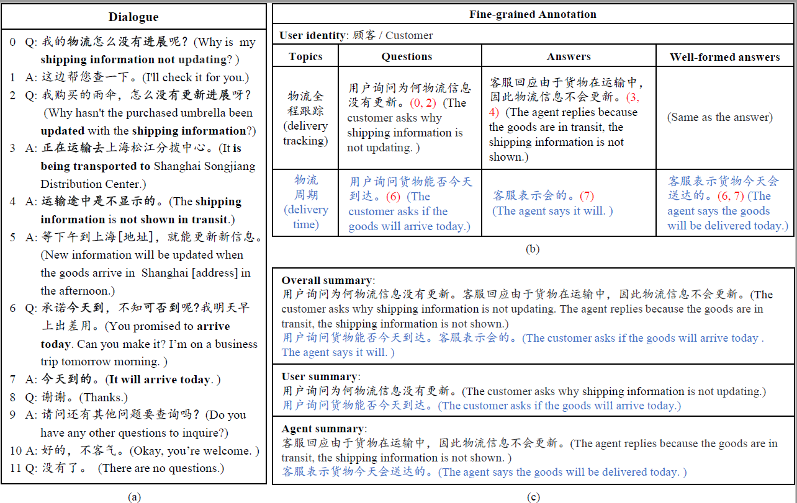

# CSDS
This is the official repo for paper "CSDS: A Fine-grained Chinese Dataset for Customer Service Dialogue Summarization", accepted by EMNLP 2021.

## 1. Introduction

We propose a new Chinese Customer Service Dialogue Summarization dataset  (CSDS). It aims at summarizing a dialogue considering dialogue specific features. In CSDS, each dialogue has three different types of summaries: 

- **Overall summary**: The summary condensing the main information of the whole dialogue.
- **User summary**: The summary focusing on the user's main viewpoints.
- **Agent Summary**: The summary focusing on the agent's responses.

Besides, each summary are split into several segments, where each segment represent a single topic with its topic label. (A few segments may not have topic labels.) An example annotation is given as below, and if you want to see the details of how data is represented in the json file, please check the  [introduction for CSDS](utils/dataset_introduction.md).

## 2. Dataset Download

- Baidu NetDisk: https://pan.baidu.com/s/1KKKNuQO5af3JQuun1G3JDg 提取码：5dii
- Google Drive: https://drive.google.com/drive/folders/1IrpEUTR2ZanN0ZKmKcbaXjruTAD9JLkF?usp=sharing

## 3. Usage

Requirements
